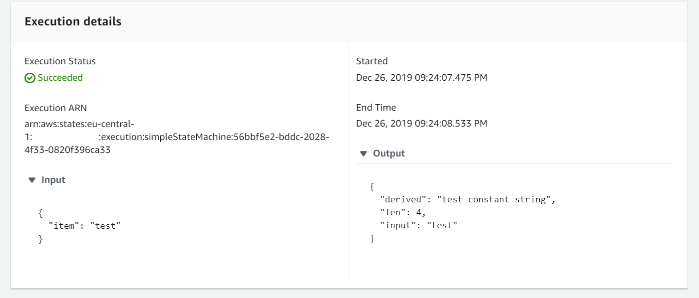

# Simple example
this state machine references the stack from the json helper lambda function and creates some derived parameters in the 
first step using the helper lambda and some json path expressions.

## Note: the helper lambda function has to be deployed before this one could be deployed
 
*Input*
```json
{
	"item": "test"
}
```

*Output*
```json
{
	"derived": "test constant string",
	"len": 4,
	"input": "test"
}
```

*Execution Result*

